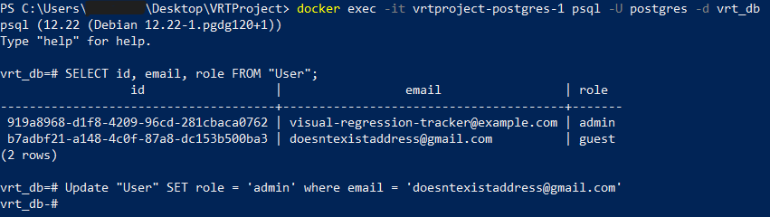

# ⚙️ Visual Regression Tracker

## Prerequisites

Before starting, ensure you have the following installed:

- Docker Desktop  
- WSL (if working on corporate devices and want to run locally)  
- IntelliJ (or your preferred IDE)

---

## Step 1: Set Up the Project Directory

Create any folder on your desktop and paste the provided `docker-compose.yml` and `.env` file into this directory.

---

## Step 2: Open PowerShell and Navigate to the Folder

Open **Windows PowerShell as Administrator**, then navigate to your newly created folder using a command like: **cd C:\Users{Your User}\Desktop\VRTFolder**

---

## Step 3: Start Docker Containers

Run the following command: **docker compose up -d**

Wait for the containers to finish starting. You should see output like this:

In Docker Desktop, wait for the **migrations** container to finish running.

Once complete, VRT should be up and running. You can now access it at: localhost:8080

---

## Step 4: Register and Access the Dashboard

Register using your email and confirm you can see the **Projects Dashboard**.

---

## Step 5: Gain Admin Access

Open a **new PowerShell window** and run the following commands:

1. Enter the PostgreSQL shell:

   **docker exec -it {containerName} psql -U postgres -d vrt_db**

2. Check your user ID and role:

   **SELECT id, email, role FROM "User";**

3. Update your role to admin:

   **UPDATE "User" SET role = 'admin' WHERE email = 'your@email.com';**

---

You now have full admin permissions! 🎉

