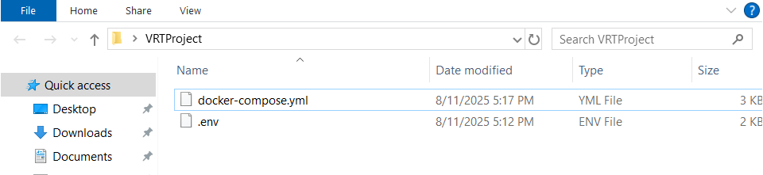
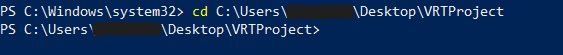
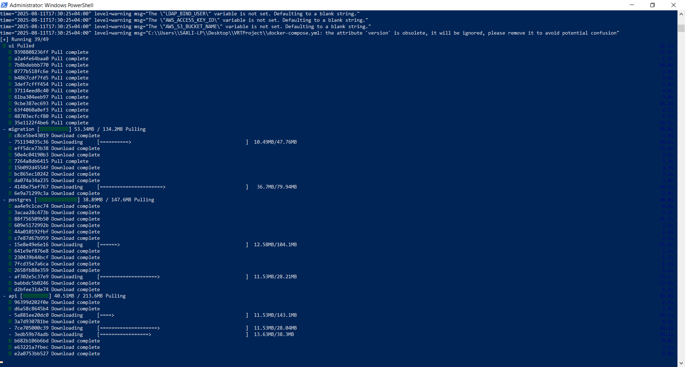
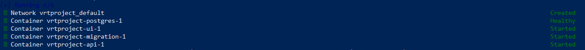
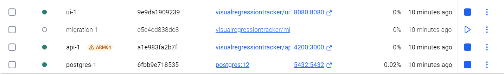
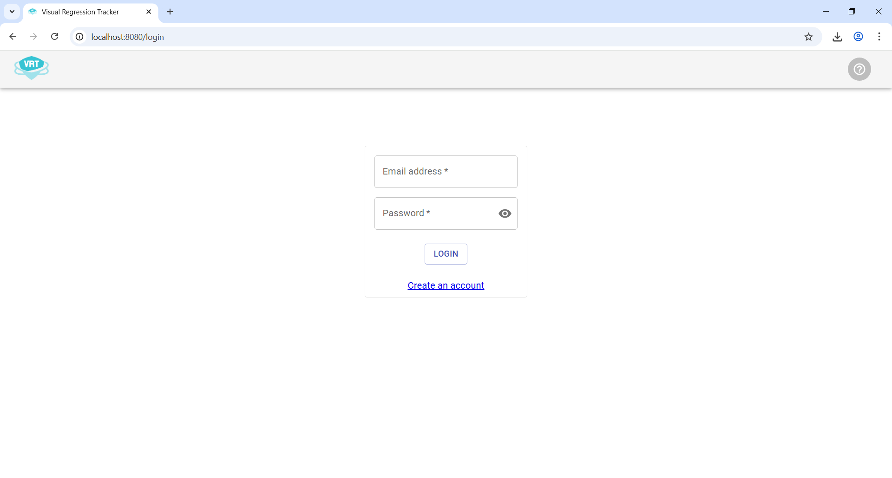

<h1 align="center">⚙️ Visual Regression Tracker</h1>

<p align="center">
  <b>Run and integrate Visual Regression Tracker with Java SDK</b>
</p>

<p align="center">
  <a href="https://jitpack.io/#Visual-Regression-Tracker/sdk-java">
    
  </a>
  <a href="https://github.com/Visual-Regression-Tracker/Visual-Regression-Tracker/blob/master/LICENSE">
    
  </a>
  <a href="https://hub.docker.com/r/visualregressiontracker/visual-regression-tracker">
    
  </a>
</p>

---
## Prerequisites

Before starting, ensure you have the following installed:

- Docker Desktop  
- WSL (if working on corporate devices and want to run locally)  
- IntelliJ (or your preferred IDE)

---

## Step 1: Set Up the Project Directory

Create any folder on your desktop and paste the provided `docker-compose.yml` and `.env` file into this directory.



---

## Step 2: Open PowerShell and Navigate to the Folder

Open **Windows PowerShell as Administrator**, then navigate to your newly created folder using a command like: **cd C:\Users{Your User}\Desktop\VRTFolder**




---

## Step 3: Start Docker Containers

Run the following command: **docker compose up -d**


Wait for the containers to finish starting. You should see output like this:





In Docker Desktop, wait for the **migrations** container to finish running.



Once complete, VRT should be up and running. You can now access it at: localhost:8080




---

## Step 4: Access the dashboard as default admin user

User: visual-regression-tracker@example.com
Password: 123456

---

Now you are ready to start visual testing! 🎉
---

## 📦 SDK Installation

### Maven Setup

Add the following to your **`pom.xml`**:

```xml
<repositories>
    <repository>
        <id>jitpack.io</id>
        <url>https://jitpack.io</url>
    </repository>
</repositories>

<dependency>
    <groupId>com.github.Visual-Regression-Tracker</groupId>
    <artifactId>sdk-java</artifactId>
    <version>4.5.1</version>
</dependency>
```

### Basic Usage

```java
VisualRegressionTrackerConfig config = VisualRegressionTrackerConfig.builder()
        .apiUrl("http://localhost:3000")
        .apiKey("your-api-key-here")
        .project("your-project-name-here")
        .branchName("master")
        .enableSoftAssert(true) // optional
        .build();

VisualRegressionTracker vrt = new VisualRegressionTracker(config);

vrt.start();

vrt.track(
        "Sample-Photo-Name",
        base64Image // any image here
);
```

### Advanced with Options
```java
vrt.track(
        "Sample-Image",
        base64Image,
        TestRunOptions.builder()
                .os("Windows 10")
                .browser("Chrome 115")
                .device("PC")
                .viewport("1920x1080")
                .diffTollerancePercent(2.5f)
                .ignoreAreas(
                        List.of(
                                IgnoreAreas.builder()
                                        .x(100L)
                                        .y(200L)
                                        .width(300L)
                                        .height(150L)
                                        .build(),
                                IgnoreAreas.builder()
                                        .x(500L)
                                        .y(600L)
                                        .width(250L)
                                        .height(100L)
                                        .build()
                        )
                )
                .build()
);
```

## 🙏 Credits

This setup guide is inspired by and built upon the work of the [Visual Regression Tracker](https://github.com/Visual-Regression-Tracker/Visual-Regression-Tracker) project and its awesome contributors.  
All credit goes to the original authors and maintainers of VRT.


